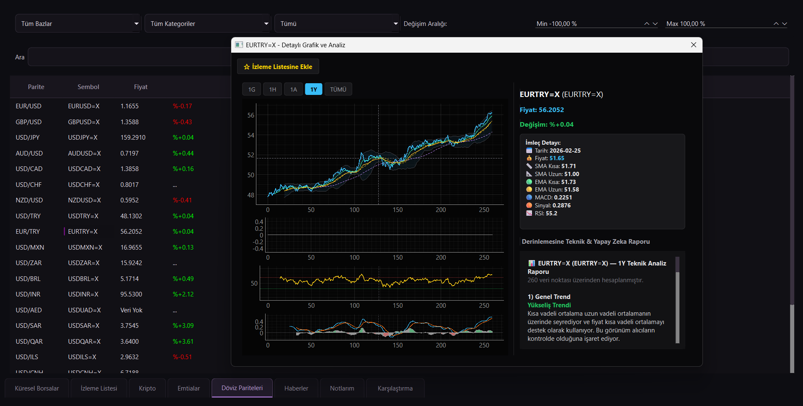
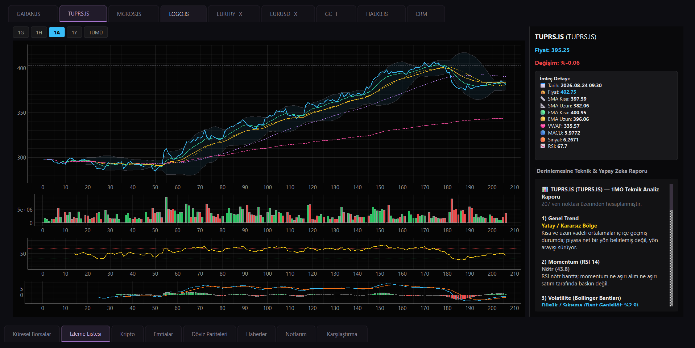

# 📈 Finans Takip Uygulaması

Python ve PySide6 ile geliştirilmiş; hisse, kripto ve döviz piyasalarını gerçek zamanlı izleyen, RSI, MACD ve korelasyon analizi gibi teknik göstergelerle otomatik yorum üreten gelişmiş bir masaüstü finans takip ve analiz uygulamasıdır.

---

##  Başlıca Özellikler

* **Gerçek Zamanlı Piyasa Takibi:** Döviz, parite, hisse senetleri ve kripto varlıkların anlık takibi.
* **Teknik Göstergeler:** RSI, MACD ve otomatik korelasyon analizleri.
* **Akıllı İzleme Listesi:** Kullanıcıya özel özelleştirilebilir izleme modülleri.
* **Modern Arayüz:** PySide6 (Qt) kullanılarak tasarlanmış şık, kullanıcı dostu ve akıcı masaüstü deneyimi.

---

##  Kullanılan Teknolojiler

* **Dil:** Python
* **Arayüz (GUI):** PySide6, Qt Designer
* **Veri İşleme & Analiz:** Pandas, NumPy
* **Veritabanı:** SQLite / Yerel veri yönetimi

